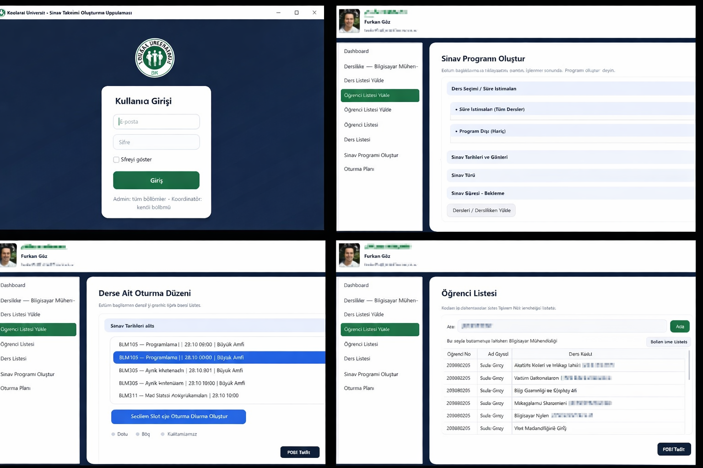
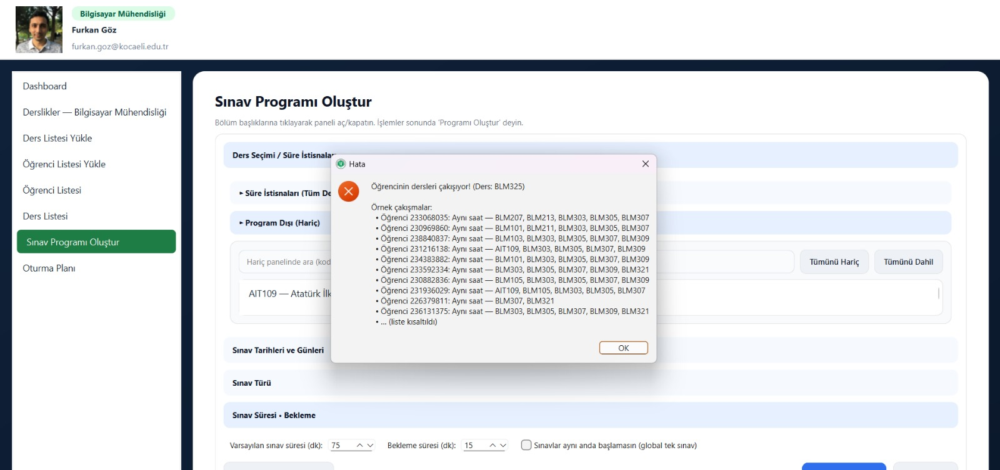

# Exam_Scheduler
DİNAMİK SINAV TAKVİMİ VE OTURMA PLANI SİSTEMİ
Dynamic Exam Scheduling and Seating Plan System

====================
TÜRKÇE
====================

PROJE TANIMI
Bu proje, üniversite genelinde çakışmasız, adil ve optimize edilmiş sınav takvimleri
oluşturmayı amaçlayan PyQt6 tabanlı bir masaüstü uygulamasıdır.

Sistem; dersler, öğrenciler, öğretim elemanları ve derslikleri birlikte ele alarak:
- Öğrencilerin aynı anda birden fazla sınava girmesini engeller
- Derslik kapasitesini verimli şekilde kullanır
- Otomatik sınav takvimi ve oturma planı üretir
- Sonuçları PDF ve Excel formatlarında dışa aktarır

Bu proje Kocaeli Üniversitesi Yazılım Laboratuvarı I dersi kapsamında geliştirilmiştir.

KULLANILAN YÖNTEM VE ALGORİTMALAR
- Dersler arası ilişkiler çakışma grafı (conflict graph) ile modellenmiştir
- Graf boyama (graph coloring) yaklaşımı kullanılarak sınav slot ataması yapılmıştır
- Dersler, öğrenci sayısı ve çakışma derecesine göre önceliklendirilmiştir
- Derslikler kapasiteye göre otomatik atanmıştır
- Her ders için derslik bazlı oturma planı üretilmiştir
- Çakışma, kapasite ve yasaklı gün gibi kısıtlar otomatik olarak kontrol edilmiştir

UYGULAMA ÖZELLİKLERİ
- PyQt6 ile geliştirilmiş masaüstü grafik arayüz
- Kullanıcı giriş sistemi (Admin / Kullanıcı)
- Excel üzerinden toplu veri içe aktarma
- Takvim ve tablo tabanlı sınav görünümü
- Etkileşimli oturma planı görselleştirmesi
- PDF ve Excel çıktı alma
- Hata, uyarı ve log paneli

KULLANILAN TEKNOLOJİLER
- Python 3
- PyQt6
- Pandas
- NetworkX
- SQL / MSSQL
- Excel ve PDF çıktı araçları

PROJE YAPISI
sinavprogrami/
- app.py              : Ana uygulama dosyası
- auth.py             : Kullanıcı doğrulama işlemleri
- login.py            : Giriş işlemleri
- login_dialog.py     : Giriş arayüzü
- main_window.py      : Ana pencere ve arayüz
- dp.py               : Planlama algoritmaları
- dp_check.py         : Çakışma ve kısıt kontrolleri
- SQLQuery.sql        : Veritabanı sorguları
- DersListesi.xlsx    : Örnek veri dosyası

NASIL ÇALIŞTIRILIR

1) Gerekli kütüphaneleri yükleyin:
pip install pyqt6 pandas networkx

2) Uygulamayı çalıştırın:
python app.py

3) Kullanım adımları:
- Uygulamayı başlatın
- Giriş yapın (Admin kullanıcı varsayılan olarak tanımlıdır)
- Excel dosyası ile ders ve öğrenci verilerini yükleyin
- Kısıtları belirleyin (tarih aralığı, sınav türü, yasaklı günler)
- “Programı Oluştur” butonuna basın
- Sınav takvimini ve oturma planını inceleyin
- PDF veya Excel çıktısı alın

GELİŞTİRİCİLER
- Zeynep Vuslat Solmaz
- Ayşenur Karaaslan

====================
ENGLISH
====================

PROJECT DESCRIPTION
This project is a PyQt6-based desktop application designed to generate
conflict-free, fair, and optimized exam schedules at the university level.

The system:
- Prevents students from having overlapping exams
- Efficiently utilizes classroom capacity
- Automatically generates exam schedules and seating plans
- Exports results as PDF and Excel files

METHODS AND ALGORITHMS
- Courses are modeled using a conflict graph
- Graph coloring is used for exam time slot assignment
- Priority-based scheduling according to student count and conflict degree
- Automatic classroom assignment based on capacity
- Classroom-based seating plan generation
- Automatic constraint violation detection

FEATURES
- Desktop GUI developed with PyQt6
- User authentication system (Admin / User)
- Excel-based bulk data import
- Calendar and table-based exam view
- Interactive seating plan visualization
- PDF and Excel export
- Error and warning panel

TECHNOLOGIES
- Python 3
- PyQt6
- Pandas
- NetworkX
- SQL / MSSQL
- Excel and PDF export tools

HOW TO RUN

1) Install dependencies:
pip install pyqt6 pandas networkx

2) Run the application:
python app.py

3) Workflow:
- Launch the application
- Log in as admin or user
- Import course and student data via Excel
- Define scheduling constraints
- Click “Generate Schedule”
- Review exam calendar and seating plan
- Export results as PDF or Excel

DEVELOPERS
- Zeynep Vuslat Solmaz
- Ayşenur Karaaslan

NOTE
This project was developed for academic and portfolio purposes and is open
to further improvements and extensions.

====================
UYGULAMA EKRAN GÖRÜNTÜLERİ
====================

Genel Uygulama Önizleme
----------------------
Sistemin giriş ekranı, dashboard ve temel modüllerini gösteren genel görünüm.

Çakışma ve İstisna Yönetimi
--------------------------
Sınav programı oluşturulurken tespit edilen öğrenci çakışmaları,
süre ve ders istisnalarının kullanıcıya detaylı şekilde raporlanması.

Oturma Düzeni ve Derslik Yerleşimi
----------------------------------
Seçilen sınav slotu için derslik bazlı otomatik oluşturulan
oturma planı ve öğrenci yerleşimi görselleştirmesi.

